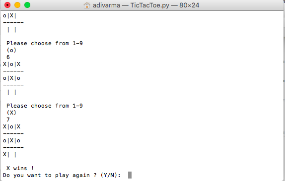

# TicTacToe-Python
Object oriented Tic Tac Toe game in Python

# Game Output:

# Methods:
There are methods to update the board based on user standard_input, to check for the winner, to check for a tie situation, to reset the board and replay the game.
